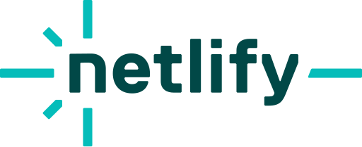
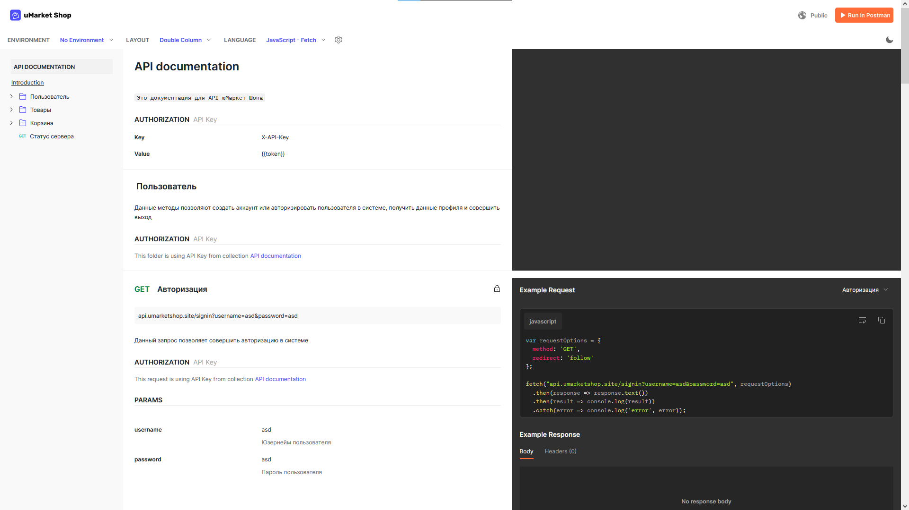

<h1 align="center">
  <a href="https://umarketshop.site"></a>
</h1>

<p align="center">
юМаркет Шоп - платформа электронной коммерции
</p>


##### app.umarketshop.site


##### api.umarketshop.site


##### umarketshop.site

  

##### bugs.umarketshop.site

 

### юМаркет Шоп (uMarket Shop) v1.0 - платформа электронной коммерции

Данная версия включает в себя:

Общее:
- Показачный лендинг;
- Авторизация;
- Регистрация;
- Добавление товара в корзину;
- Страница товара;
- Просмотр отзывов;
- Возможность оставить отзыв на товар;
- Страница акции;
- Поиск товаров по ключевым словам;
- Управление сеансами авторизации;
- Пополнение баланса через Юмани;
- Контроль покупки.

Возможности поставщика:
- Панель поставщика;
- Редактирование данных о организации поставщика;
- Добавление товаров;
- Редактирование данных о товаре;
- Загрузка фотографий товара;
- Возможность дать ответ на отзыв.

Возможности администратора:
- Панель администратора;
- Переключение с глобального сервера на локальный (Для разработки);
- Информация о проекте (Версия React);
- Переход к Яндекс-метрике;
- Переход к Google Analytics;
- Логирование подключений к сайту;
- Просмотрт всех пользователей;
- Поиска пользователей по юзернейму;
- Редактирования данных пользователя;
- Удаления аккаунта;
- Вывод всех поставщиков;
- Поиска поставщиков;
- Редактирование данных поставщика;
- Возможность смены менеджера у организации поставщика;
- Просмотр жалоб пользователей о товаре;
- Подтверждение удачных сделок.

Возможности тестировщика:
- Все возможности пользователя;
- Доступ к баг-трекеру.

###  Технические характеристики платформы:

### Хостинг серверной части
<p style="display: flex; gap: 10px; background: #fff; padding: 10px">
    
</p>

#### Технологии, используемые в работе серверной части

<p style="display: flex; gap: 10px; background: #fff; padding: 10px">


</p>


### Хостинг клиентской части
<p style="display: flex; gap: 10px; background: #fff; padding: 10px">
    
</p>

#### Технологии, используемые в работе клиентской части

<p style="display: flex; gap: 10px; background: #fff; padding: 10px">


</p>


## api.umarketshop.site
На этом домене расположена серверная часть платформы.
Её назначение - обеспечение функциональности проекта путем взаймодействия методом REST API

Перейдя на сам сайт, Вас перешлёт на документацию API, где будут описаны доступные методы и преимуществом будет то, что есть вариативность расписанных методов на разных языках программирования.




### Пример работы методом REST API

Предоставим пример ответа `https://api.umarketshop.site/live`
```JSON
{
  "status": true,
  "message": "Сервер работает и может обрабатывать запросы",
  "data": []
}
```

## umarketshop.site
[](https://app.netlify.com/sites/sunny-blancmange-7e001d/deploys)

Это показачный лендинг, который описывает площадку для потенциальных пользователей.


## app.umarketshop.site
[](https://app.netlify.com/sites/lovely-muffin-e8afc6/deploys)

Это само веб-приложение платформы электронной коммерции. Тут пользователь уже регистрируется, авторизуется и пользуется всеми описанными возможностями выше.


## bugs.umarketshop.site
[](https://app.netlify.com/sites/inspiring-medovik-be139c/deploys)

Это баг-трекер. Эта страница создана для информирования тестировщиков о тестировании, а так же получения доступа к подаче отчета.


